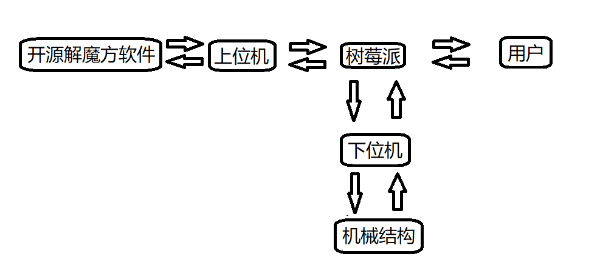
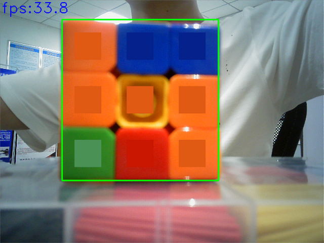
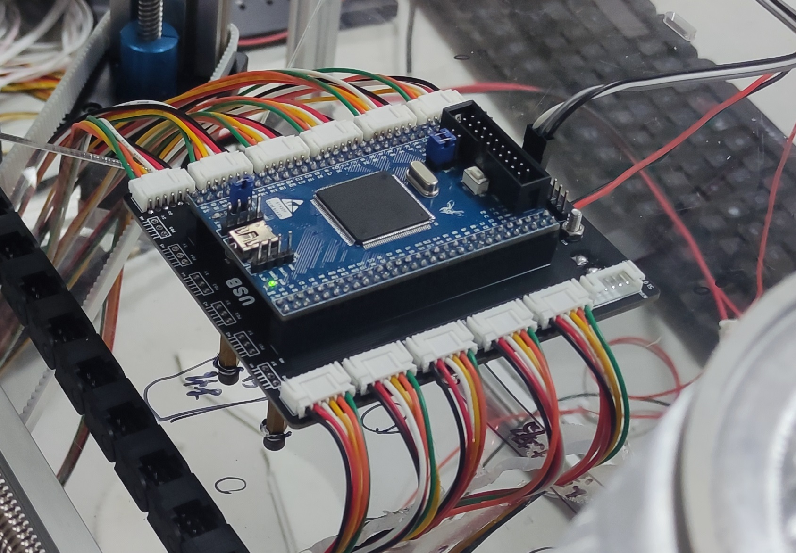
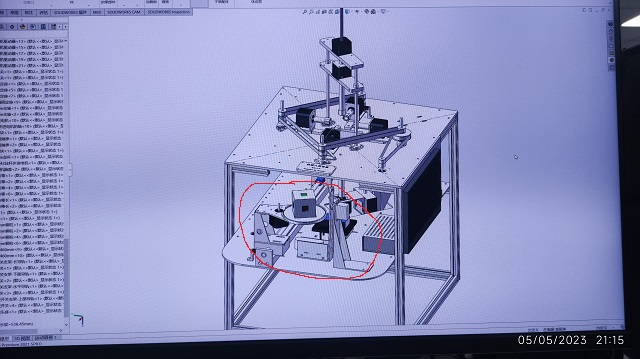

# MagicCubeRobot
自己做的一个全自动解魔方装置. (下了大力气, 花了大价钱)

我的邮箱地址: TwithZ@163.com, 欢迎讨论交流!

演示视频地址: [演示视频](https://www.bilibili.com/video/BV1zj411979p/?vd_source=939818502857687a4a334c7a40d2c98a).

## 1. 整体简介
这是我做的第一个完整度较高的项目, 整体分为3个部分: 上位机, 下位机, 机械结构.
1. 上位机: (树莓派+上位机)
   1. 使用的技术: 树莓派4B(8GB); 使用opencv进行图像处理; 全部使用C++语言编写; 使用g++编译器构建; 使用CMake工具管理工程; 使用git进行版本控制; 使用POSIX pthread线程库进行多线程设计; 使用了WiringPi库控制串口(但实际大多是使用的都是Linux的系统调用进行数据读写); 没有使用GUI, 采用了CLI的方式与用户交互(虽然但是, 经过我的设计, 操作起来也非常方便); 还用Qt编写了一个上位机(仅用于中继, 它的功能后面会介绍), 其中使用了winsocket进行本机网络通信.
   2. 负责的功能: 负责与用户的交互, 图像的采集, 魔方描述字符串的生成, 与开源解魔方软件网络通信, 与下位机通信.
2. 下位机:
   1. 使用的技术: STM32F407+FreeRTOS.
   2. 负责的功能: 接收上位机传来的指令, 并控制步进电机运动.
3. 机械部分: SolidWorks, 零件都是在网上加工的, 使用的材料有CNC铝加工(只用了一小点, 奈何实在是太贵了), 3D打印树脂, 尼龙, 亚克力板, 不锈钢冲压工艺. (后面这些都是妥协的. 由于第一次做机加工这种事, 前期没有料想到CNC铝加工这么贵, 所以最开始计划的是全部都是用CNC, 后来发现太贵了, 才一点一点妥协, 从铝变成了3D打印塑料, 变成了冲压的不锈钢, 变成了亚克力板. 不过我感觉这也是一个成长过程吧, 以后做产品的话, 在机加工这方面也肯定是要根据成本来选择加工工艺的啊)

## 2. 软件架构介绍

**1. 架构图说明**: 整体架构关系图如上图所示, 在操作过程中, 用户只需要通过鼠标键盘与树莓派进行交互就可以了, 极大简化了操作, 在设计时我是有意设置成这样的, 用户完全不用操作STM32, <u>我相当于把STM32当做了树莓派的一个从设备.</u> 系统上电之后(就只有一个开关), 用户所需做的就是操作鼠标和键盘. 用户把需要的动作以指令的形式输入给树莓派, 树莓派会将会根据指令控制STM32, 进而控制机械机构来执行对应动作.

**2. 工作流程**: 系统初始化 > 树莓派采集图像 > 通过算法识别出魔方6个面, 共计54个色块的颜色 > 树莓派根据颜色生成描述魔方色块和方位信息的字符串 > 将字符串通过串口发送给上位机 > 上位机通过网络将该字符串发送给开源解魔方软件, 该软件会自动给出魔方还原步骤, 并返回给上位机 > 上位机将还原步骤发送给树莓派 > 树莓派将还原步骤发送给下位机 > 下位机根据还原步骤解析生成实际控制电机的结构体数组 > STM32控制机械结构全自动完成魔方还原.

**3. 上位机软件设计**: 使用树莓派4B, 采用POSIX多线程. 使用opencv进行图像处理和颜色识别. 下面只讲几个比较重要的点吧.
1. 实时识别. 颜色识别是在视频流中直接识别的, 而不是先拍摄图像, 后进行识别. 这样反馈通路的延迟小, 便于快速获得识别结果. 程序在视频流中直接显示识别结果, 当识别结果正确时, 用户只需要敲一下键盘即可去识别魔方的下一个面.
   
2. 颜色识别算法在**BGR色彩空间**中完成, 使用颜色距离来判断两种颜色的接近程度, 从而判断出目标色块的颜色. 因为一种彩色有BGR共3个通道, 也就是3个分量, 如果分别以BGR3个分量为坐标轴, 那么它们所能形成的所有颜色, 在空间中就可以形成一个处于第一卦限的正方体(离散的). 那么以这种视角, 每一种颜色在空间中也就是一个点, 那么两种颜色的接近程度就可以用这两个点之间的距离来衡量, 距离近表示两种颜色很接近, 距离远表示两种颜色差异很大. (注: 这里这种距离我使用的是欧氏距离, 具体原因我目前无法解释, 但是效果很好; 还有一种距离叫曼哈顿距离, 我没有试, 不知道效果会怎么样). 公式如下:
$$
d = \sqrt[2]{(b - b_0)^2 + (g - g_0)^2 + (r - r_0)^2}
$$
3. 在图像领域一个非常影响软件性能的因素就是光照, 在这个项目的颜色识别中也不例外, 我在设计中非常要注意的一个点就是对于光照的抗干扰能力要强. 为此我设计了一个debug线程, 专门用于调整bgr的阈值, 因为识别颜色主要就靠这些阈值来进行的. 不同于一般的手动调整阈值的方法, 我在设计时着重考虑了易用性, 即**用户友好性friendly**. 当某个颜色识别不准确时, 只需按下一个键便会自动创建一个debug线程, 然后在这里用户只需要手动指定一下识别不准确的颜色, 然后程序会自动计算该处的bgr值, 然后以计算得到的值来作为阈值. (实际测试, 这种方法效果很好)
4. 设计实现了一个功能类似shell的软件. 实现的效果为: 用户可以在树莓派的terminal中输入一个函数名, 并带上参数, 然后回车, 单片机上就可以执行同名的函数, 并使用在terminal输入的参数(且参数可定制, 默认支持3个参数). 即我可以在单片机运行时手动让其执行某个函数. 这种设计非常方便调试!!! (还有种**分布式**的概念在里面, 树莓派上的线程, 单片机上的线程, 都当做是同等的线程, 只不过是跑在不同的设备上的而已, 我在用的时候直接就把单片机上的线程当做了树莓派上的线程, 因为使用起来在用户看来没什么两样, 中间那一层对用户来说是**透明的**)

**4. 下位机软件设计**: 采用了FreeRTOS实时操作系统, 采用多线程设计, 在软件编写上比裸机要更容易一些. 在该项目中我共使用了4个线程, 分别是: LED状态灯线程`status_led_task`, 限位开关扫描线程`limit_task`, 命令处理线程`cmd_proc_task`, 数据处理线程`data_proc_task`.
1. LED状态灯线程就是用于控制指示灯的亮灭(线程的优先级很低). 在实际产品中, 指示灯的设置非常重要, 它可以用于判断系统是否工作正常, 对于软件调试非常重要.
2. 限位开关扫描线程, 它就是用于扫描限位开关状态的, 因为使用的是步进电机, 并不是闭环的伺服电机, 所以需要使用限位开关来设定初始位置, 再假定步进电机不丢步, 近似认为其是一个闭环系统. 本项目中限位开关的扫描频率为100Hz(最大为), 周期10ms, 要根据滑轨的速度来调节该扫描频率, 过快浪费系统资源, 过慢起不到效果.
3. 命令处理线程和数据处理线程, 在树莓派中我设计了两个程序, 一个是主要的程序, 用于图像识别和解魔方, 还有一个程序时专门用于调试的, 其位置在`./树莓派部分/MagicCubeRobot/manual_mode`文件夹下, 见名知意, 即手动模式, 也就是说用户可以通过键盘来控制机械结构的运动, 它跟用于图像识别的程序对STM32的控制是独立的, 所以我在这里就设计了两个线程来分别接收这两个程序对STM32的控制, 但是使用的是同一套通信协议(这个后面讲), 数据处理线程用于处理图像识别程序发来的数据, 命令处理线程用于处理手动控制程序发来的数据. 下面讲一下实现细节:
   - 由于通过树莓派发来的数据都并非是单个字节的, 而是很大一长串, 而且数据的长度还是不确定的(如魔方还原步骤的长短可能不同), 所以这就涉及到串口不定长数据的接收, 关于不定长数据的接收有很多方式, 其中正点原子的方式我感觉不是很好, 至少不是专业的方法, 它是用串口接收中断, 来一个字节就接收一个字节, 最后拼到一块. 我觉得这种方法有一个很大的缺点就是浪费资源, 因为用的是接收中断, 那如果接收的字节数非常多, 那就要中断很多次, 而且中断频率也是很高的, 因为来一个字节就要接收一次(如果波特率是115200的话, 中断频率是可以计算出来的), 而我采用的又是RTOS, 调度器才1ms中断一次, 这导致了在接收数据时, 大部分时间单片机都卡在串口接收中断里, 这很不专业. 所以我觉得这种使用串口接收中断来接收不定长数据的方式只适合做简单的应用, 不适合正规生产中. 在这里我使用的是**串口空闲中断+DMA**的方式, 这种方式高效, 不需要CPU参与数据搬运.
   - 由于数据有两个用途: 数据或命令. 所以我需要在数据包中有一个标识符来标记这个数据包是数据还是命令. 为此我设计了一个协议格式. 如下:
     ```c
     typedef struct
     {
          uint8_t  head;//!< 帧头
	      uint8_t  type;//!< 类型标识符
	      uint16_t len;//!< 数据长度
	      uint8_t  data[USART2_DMA_RECV_BUF_SIZE - 4U];//!< 数据域
     }pack_t;
     ```
     树莓派上的两个程序在向单片机发送数据时都使用这种数据包, 所以单片机就可以根据type成员来判断接收到的是数据还是命令, 从而对数据进行不同的解析, 交给不同的线程去处理.
   - 单片机串口空闲中断接收到一个数据包中断一次, 然后通过type成员执行不同的操作, 进而唤醒不同的线程(当没有接收到数据时, 对应的线程都是阻塞状态的), 进行不同的处理.
   - 还有一些别的细节, 如两种数据的种类是不一样的, 命令时数据类型是`uint32_t`型的, 而数据时数据类型是`uint8_t`类型的, 为了方便, 我在设计时将数据传输流规定为了使字节流, 所以如果传输的是命令, 还要根据机器的**大小端**进行4个byte拼接为一个`uint32_t`.

**5. 一些软件设计细节!!!**: (代码强迫症...)
1. 代码命名规范. 命名使用Unix的风格, 即全部小写, 以下划线分隔; 对于常用单词的缩写也有规定, 对于同一个单词, 不允许使用不同的缩写. 比如length缩写就为len, command的缩写久违cmd, 所有地方都保持统一. 这种做法有人可能认为是强迫症, 但我认为"不乱起名", "名称保持统一"在软件开发中是一个好习惯, 不至于引起迷惑!!!
2. 注释规范. (符合doxygen注释规范, 便于自动生成文档)
   ```c
   //! 单行行首注释.
   func_bar();//!< 单行行尾注释.
   /*!
    * 多行注释.
    * 多行注释.
    */
3. Terminal中输出的信息为彩色, 不同level的log用不同颜色的输出表示. 典型的就是绿色表示成功, 红色表示失败. 我还使用了蓝色表示较为重要的提示.
4. 统统采用多线程设计. 我觉得这应该是以后的主流, 裸跑不太好.


## 3. 硬件部分
这一部分就只是设计了一个转接板, 主要是为了方便连线, 不让走线太凌乱, 因为一共使用了11个步进电机, 1个舵机, 4个限位开关, 一共大约是125根线, 如果都直接连到核心板上多少有点难看, 而且还不稳定, 再者我要以做产品的标准来要求自己, 所以我弄了一个转接板, 通过接线端子来吧这些线引出去, 最终效果很好, 也没有显得很凌乱.


## 4. 机械部分

这一部分也是我在这个项目中花费精力最大的一部分, 由于之前没有做过机加工的经验, SolidWorks也是现学现卖, 对于很多东西都不懂, 中间也踩了很多坑, 在这里感谢实验室王老师的资金支持!!!

在设计机械机构使我的主要目标就是要实现全自动, 之前一代解魔方机器是使用了4个摄像头, 这里我设计了一套机械装置实现了仅使用一个摄像头就可以实现对魔方6个面的图像采集. 如上图中红圈中的结构.

为了保证水平方向4个拧手在向中心运动时的一致性, 我还设计了一套联动机构, 通过同步轮和同步带实现水平方向4个电机同时到达中心位置.

总之吧, 在设计上我注意了很多细节, 这里就不一一说了, 说多了都是泪......

---

2023年8月18日00:31:47
